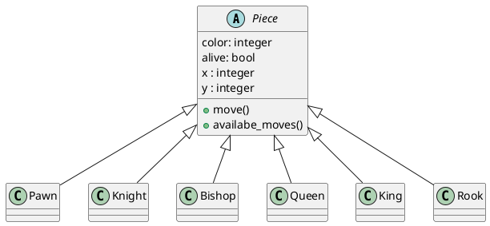

chess game with AI
===

* Jeu d'échecs 1v1
* IA (mélange Machine Learning + Minimax Alpha Beta)
* Images SVG
* Python + Django

## Todo

[Dataset chess Top 12 Players](https://www.kaggle.com/datasets/liury123/chess-game-from-12-top-players)