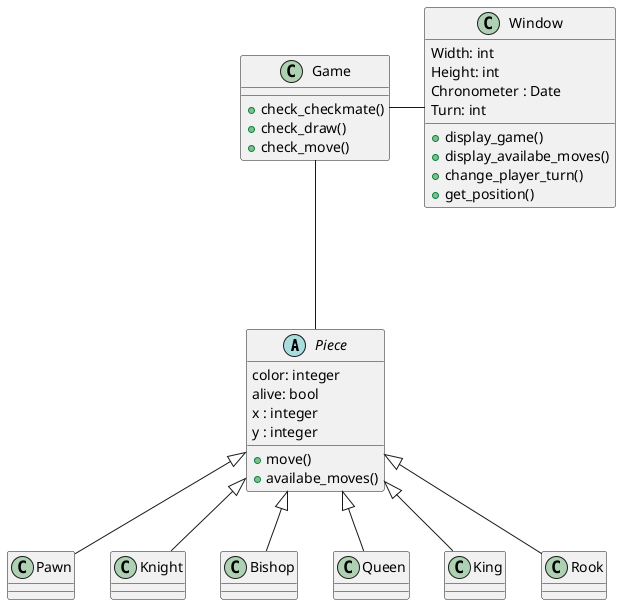

chess game with AI
===

* Chess Game (1V1)
* AI (Mix of Machine Learning and Minimax)
* Python + Kivy 
* Play with your phone
* Convert to Windows / Mac 
* Kivy Mob

## Todo

[Dataset chess Top 12 Players](https://www.kaggle.com/datasets/liury123/chess-game-from-12-top-players)

